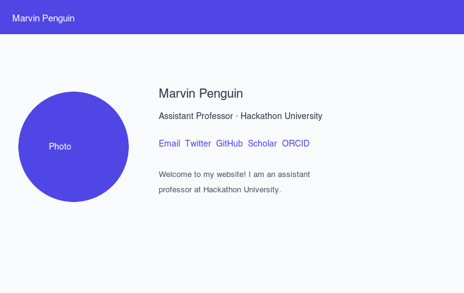
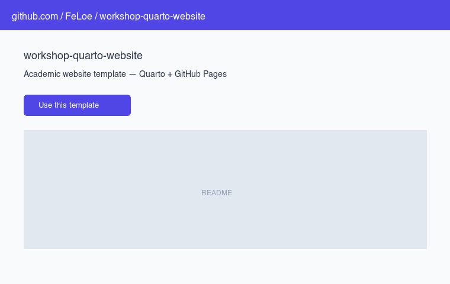
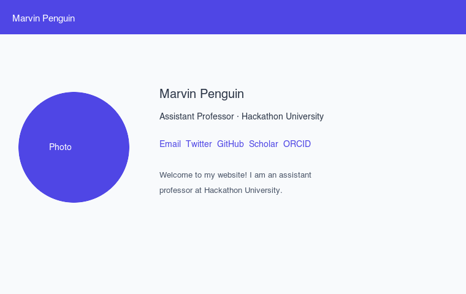
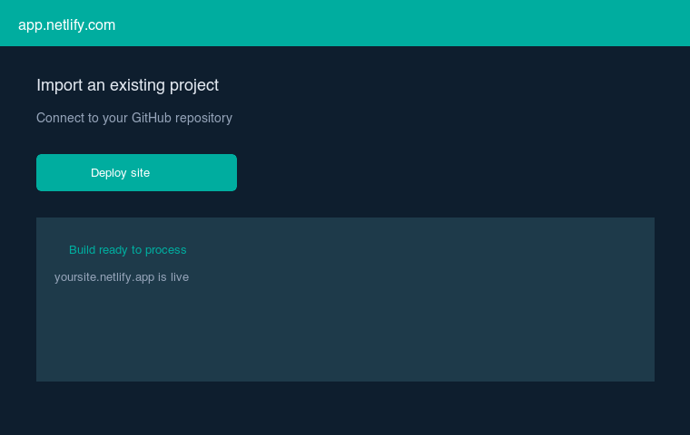

## Why bother? {background-color="#4f46e5"}

::: {.columns}
::: {.column width="60%"}
**Your website is your academic home base**

- Publications in one place with abstracts & links
- Findable when people Google your name
- Easy to send one URL to collaborators, reviewers, students
- You control the content — not a third-party platform
- **Free to build and host**
:::
::: {.column width="40%"}
{width=280px fig-align="center"}
:::
:::

::: notes
Ask the room: how many of you have a personal website? How many have had someone struggle to find your contact info or latest paper?
:::

---

## Today's plan

| Time | What |
|------|------|
| 5 min | What you'll build + two pathways |
| 5 min | What you need to prepare |
| 20 min | Live demo |
| 25 min | Hands-on: your own content |
| 5 min | Wrap up & questions |

::: {.callout-tip}
## Before we start
You need a **GitHub account** — create one at [github.com](https://github.com) if you don't have one yet.
:::

::: notes
This is a fast-paced workshop. The goal is that everyone leaves with a working URL. Perfecting content comes later.
:::

---

## What you'll build {.smaller}

::: {.columns}
::: {.column width="50%"}
**A simple, effective academic site with:**

- About / bio page with photo
- Publications list (with abstracts)
- Talks & presentations
- CV page
- Auto-deploys when you push to GitHub

**Two tools, same result — pick what fits your workflow**
:::
::: {.column width="50%"}
{width=400px}
:::
:::

---

## Two pathways {background-color="#1e293b"}

::: {.columns}
::: {.column width="48%"}
### Path A: Quarto
**Best for R / Python users**

- You already know the tool
- Markdown files, no theme complexity
- GitHub Pages (free hosting)
- One push = live site

:::
::: {.column width="4%"}
:::
::: {.column width="48%"}
### Path B: Hugo Blox
**Best for a polished academic look**

- Purpose-built for academic sites
- Auto-generates publication pages
- Netlify (free hosting)
- One push = live site
:::
:::

::: {.callout-note}
## Same workflow, different tools
Both use: **edit a file → commit → push → site updates automatically**
:::

---

## What to prepare {.smaller}

Get these ready before the hands-on section:

::: {.columns}
::: {.column width="50%"}
**Essential (5 minutes)**

- Profile photo (any jpg/png)
- 2–3 sentence bio
- Current job title & institution

**Nice to have**

- 2–3 publication titles + DOIs
- Links: Twitter/X, GitHub, Google Scholar, ORCID
:::
::: {.column width="50%"}
**Accounts you need**

:::{.step}
✓ **GitHub** account (both paths)
:::
:::{.step}
✓ **Netlify** account (Hugo path only)
:::

Both are free. Sign up with your GitHub account.

:::
:::

---

## Path A: Quarto {background-color="#4f46e5"}

### GitHub Pages

---

## What is Quarto? {.smaller}

**Quarto** is a publishing system from Posit (makers of RStudio).

::: {.columns}
::: {.column width="55%"}
You probably already use it for:

- R Markdown documents
- Jupyter notebooks
- Research reports

The website feature uses the same `.qmd` files — **no new tool to learn**.
:::
::: {.column width="45%"}
A `.qmd` file looks like this:

```markdown
---
title: "My Paper"
format: html
---

# Introduction

My analysis in R or Python...
```

→ The same syntax builds your website.
:::
:::

::: notes
Show of hands: who has used R Markdown or Quarto before?
:::

---

## Quarto file structure {.smaller}

::: {.filetree}
my-website/
├── **_quarto.yml** &nbsp;&nbsp;&nbsp; ← site title, theme, navbar
├── **index.qmd** &nbsp;&nbsp;&nbsp;&nbsp;&nbsp; ← your bio + photo + links
├── **publications.qmd** ← your papers list
├── **talks.qmd** &nbsp;&nbsp;&nbsp;&nbsp;&nbsp;&nbsp; ← presentations
├── **cv.qmd** &nbsp;&nbsp;&nbsp;&nbsp;&nbsp;&nbsp;&nbsp;&nbsp;&nbsp; ← CV as a web page
├── profile.png &nbsp;&nbsp;&nbsp;&nbsp;&nbsp; ← your photo
└── .github/workflows/
&nbsp;&nbsp;&nbsp;&nbsp;└── publish.yml &nbsp; ← auto-deploy (don't touch)
:::

**That's it. Five files you edit. Everything else is automatic.**

::: notes
Point out: no theme files, no layout files, no HTML. Just markdown.
:::

---

## Step 1: Fork the template

::: {.columns}
::: {.column width="55%"}
:::{.step}
**1.** Go to the template repo on GitHub
:::
:::{.step}
**2.** Click **"Use this template"** → Create new repository
:::
:::{.step}
**3.** Name it `my-website` (or anything)
:::
:::{.step}
**4.** Settings → Pages → Source: **GitHub Actions**
:::

After ~2 minutes, your site is live at
`https://yourusername.github.io/my-website`
:::
::: {.column width="45%"}
{width=380px}
:::
:::

---

## Step 2: Edit your bio

Open `index.qmd` and replace the placeholder text:

```yaml
---
title: "Your Name"
about:
  template: trestles
  image: profile.png
  links:
    - icon: envelope
      text: Email
      href: mailto:you@university.edu
    - icon: github
      text: GitHub
      href: https://github.com/yourhandle
---

I am an assistant professor of X at Y University.
My research focuses on...
```

Commit → push → site updates in ~60 seconds.

---

## Step 3: Add a publication

Open `publications.qmd` and paste:

```markdown
**Your Name, & Co-Author (2024).** Paper title.
*Journal Name*, 10(2), 100–120.
[[DOI]](https://doi.org/10.xxx/xxx)

<details>
<summary>Abstract</summary>
Paste your abstract here. Click to expand.
</details>

---
```

::: {.callout-tip}
Copy-paste one block per paper. No special syntax needed.
:::

---

## Path A: Deploy to GitHub Pages

```{mermaid}
flowchart LR
  A[Edit file] --> B[git commit]
  B --> C[git push]
  C --> D[GitHub Actions\nbuilds site]
  D --> E[Live at\nyourusername.github.io]
```

**Once set up, the only command you ever run is:**
```bash
git add .
git commit -m "added new paper"
git push
```

---

## Path B: Hugo Blox {background-color="#0f172a"}

### Netlify

---

## What is Hugo Blox? {.smaller}

**Hugo Blox** (formerly Wowchemy) is the most popular academic website theme.

::: {.columns}
::: {.column width="55%"}
Used by thousands of academics worldwide.

- Built specifically for academic profiles
- Auto-generates publication pages with abstract, links, citation
- Dark/light mode, search, tags
- Faster than Quarto for large sites

The catch: slightly more setup, YAML-heavy config.
:::
::: {.column width="45%"}
{width=380px}
:::
:::

::: notes
This is what felicialoecherbach.com runs on — you can show your own site here.
:::

---

## Hugo Blox file structure {.smaller}

::: {.filetree}
my-website/
├── config/_default/
│&nbsp;&nbsp;&nbsp; ├── **config.yaml** &nbsp; ← site title, URL, nav
│&nbsp;&nbsp;&nbsp; └── **params.yaml** &nbsp; ← theme colour, contact
├── content/
│&nbsp;&nbsp;&nbsp; ├── authors/admin/
│&nbsp;&nbsp;&nbsp; │&nbsp;&nbsp;&nbsp; └── **_index.md** &nbsp; ← bio, photo, links
│&nbsp;&nbsp;&nbsp; ├── home/ &nbsp;&nbsp;&nbsp;&nbsp;&nbsp;&nbsp;&nbsp;&nbsp;&nbsp;&nbsp;&nbsp;&nbsp; ← toggle sections
│&nbsp;&nbsp;&nbsp; └── publication/
│&nbsp;&nbsp;&nbsp; &nbsp;&nbsp;&nbsp;&nbsp; └── **my-paper/** &nbsp; ← one folder per paper
│&nbsp;&nbsp;&nbsp; &nbsp;&nbsp;&nbsp;&nbsp; &nbsp;&nbsp;&nbsp;&nbsp; └── index.md
└── netlify.toml &nbsp;&nbsp;&nbsp;&nbsp;&nbsp;&nbsp;&nbsp;&nbsp;&nbsp; ← hosting config
:::

**Rule of thumb: only edit files inside `content/` and `config/`.**

---

## Step 1: Deploy to Netlify in 3 clicks

::: {.columns}
::: {.column width="55%"}
:::{.step}
**1.** Fork the template repo on GitHub
:::
:::{.step}
**2.** Go to [netlify.com](https://netlify.com), sign in with GitHub
:::
:::{.step}
**3.** New site → Import from GitHub → pick your repo → Deploy
:::

Netlify detects Hugo automatically.
Your site is live at `yourname.netlify.app`.

*(You can set a custom domain later)*
:::
::: {.column width="45%"}
{width=380px}
:::
:::

---

## Step 2: Edit your profile

Open `content/authors/admin/_index.md`:

```yaml
title: Your Full Name
role: Assistant Professor of X

organizations:
  - name: Your University
    url: https://university.edu

interests:
  - Computational methods
  - Topic two

social:
  - icon: envelope
    icon_pack: fas
    link: "mailto:you@university.edu"
  - icon: twitter
    icon_pack: fab
    link: https://twitter.com/yourhandle
```

Add `avatar.jpg` to the same folder for your photo.

---

## Step 3: Add a publication

Copy the folder `content/publication/my-first-paper/`, rename it, edit `index.md`:

```yaml
title: "Your Paper Title"
authors: [admin, "Co-Author Name"]
date: "2024-01-01"
publication: "*Journal Name*"
doi: "10.xxxx/xxxxx"
publication_types: ["2"]   # 2 = journal article

abstract: >
  Paste your abstract here.

tags: [your topic, methods]
```

Add `featured.png` to the folder → image appears on the homepage card.

---

## Comparison {.comparison .smaller}

|  | Quarto + GitHub Pages | Hugo Blox + Netlify |
|--|--|--|
| **Setup time** | ~15 min | ~20 min |
| **Files to edit** | 4 plain markdown files | YAML config + content folders |
| **Adding a paper** | Paste text in one file | Copy folder, edit YAML |
| **Publication pages** | Manual (abstract in `<details>`) | Auto-generated with links, citation |
| **Looks like** | Clean, minimal | Feature-rich, academic |
| **Best for** | R/Python users | Anyone wanting more polish |
| **Hosting** | GitHub Pages (free) | Netlify (free) |
| **Local preview** | `quarto preview` | `hugo server` |

---

## The update workflow {.smaller}

**Both paths work exactly the same way after setup:**

::: {.columns}
::: {.column width="50%"}
**Add a new paper:**

1. Edit your file / add a folder
2. `git add .`
3. `git commit -m "added paper"`
4. `git push`
5. Wait ~60 seconds

**Your site is updated.**
:::
::: {.column width="50%"}
**Change your job title:**

1. Edit one line in one file
2. `git add .`
3. `git commit -m "updated title"`
4. `git push`
5. Done

**No CMS, no login, no clicking around.**
:::
:::

::: {.callout-tip}
## Pro tip
Write yourself a note: "website = edit file + git push". That's all you'll ever need to remember.
:::

---

## Hands-on time! {background-color="#4f46e5"}

### Pick your path and get your site live

**Template links:**

- **Quarto:** [github.com/FeLoe/workshop-quarto-website](https://github.com/FeLoe/workshop-quarto-website)
- **Hugo:** [github.com/FeLoe/workshop-hugo-website](https://github.com/FeLoe/workshop-hugo-website)

**Goal for the next 25 minutes:**

1. Fork the template
2. Replace the placeholder bio with yours
3. Add at least one real publication
4. Get a working URL

::: notes
Walk around and help people. The most common issue is GitHub Pages not being enabled — check Settings → Pages.
:::

---

## When you're stuck {.smaller}

::: {.columns}
::: {.column width="50%"}
**Quarto checklist**

- [ ] GitHub Pages set to "GitHub Actions" in Settings
- [ ] Did the Action run? (check Actions tab)
- [ ] Is your profile photo named `profile.png`?
- [ ] Did you push after committing?
:::
::: {.column width="50%"}
**Hugo checklist**

- [ ] Connected to Netlify? (check app.netlify.com)
- [ ] Did the build succeed? (check Deploys tab)
- [ ] Is your photo named `avatar.jpg` or `avatar.png`?
- [ ] Did you push after committing?
:::
:::

**Most problems are:** forgot to push · photo name mismatch · GitHub Pages not enabled

---

## Next steps {.smaller}

::: {.columns}
::: {.column width="55%"}
**After the workshop:**

- Add all your publications
- Write a proper bio
- Add your CV (`cv.qmd` / `content/cv.md`)
- Set a custom domain (optional, ~€10/year)
  - Namecheap, Hover, Google Domains
  - Both GitHub Pages and Netlify support it for free

**Keep it maintained:**

- Set a reminder every 6 months to update papers
- Every new paper = 10 minutes to add it
:::
::: {.column width="45%"}
**Resources:**

Quarto docs:
[quarto.org/docs/websites](https://quarto.org/docs/websites)

Hugo Blox docs:
[docs.hugoblox.com](https://docs.hugoblox.com)

These slides:
[github.com/FeLoe/workshop-slides](https://github.com/FeLoe/workshop-slides)

Questions after the workshop:
[f.loecherbach@uva.nl](mailto:f.loecherbach@uva.nl)
:::
:::

---

## Thank you! {background-color="#4f46e5"}

::: {.columns}
::: {.column width="60%"}
**Today you learned:**

- Two free, maintainable ways to build an academic website
- How to add publications, a CV, and a bio
- How to deploy with one `git push`

**Your site should be live by now. Share the URL!**
:::
::: {.column width="40%"}
{width=260px fig-align="center"}
:::
:::
